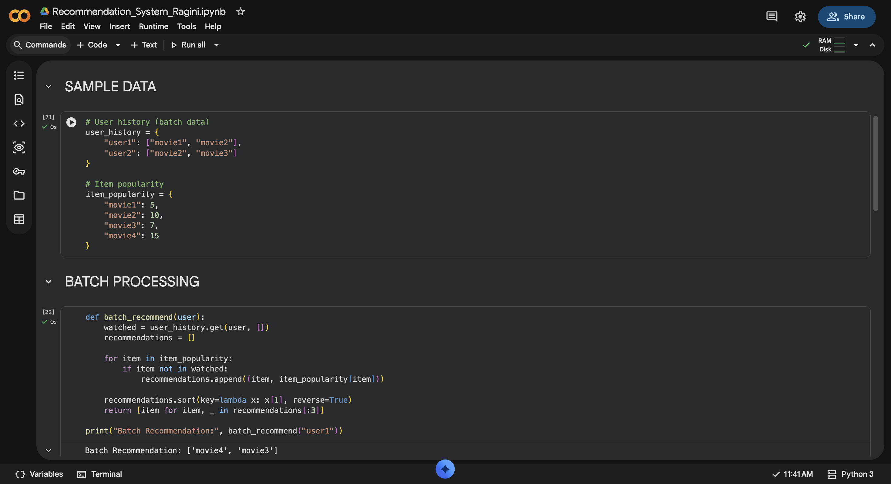
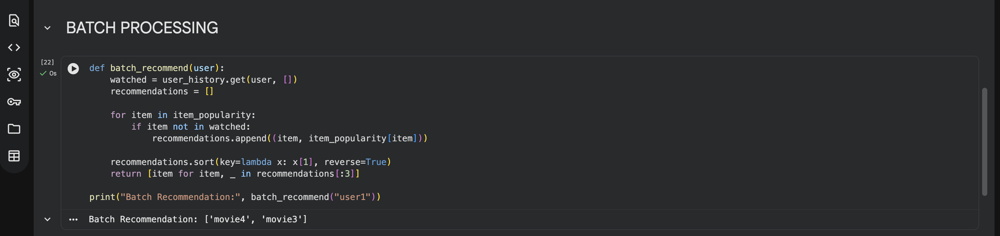
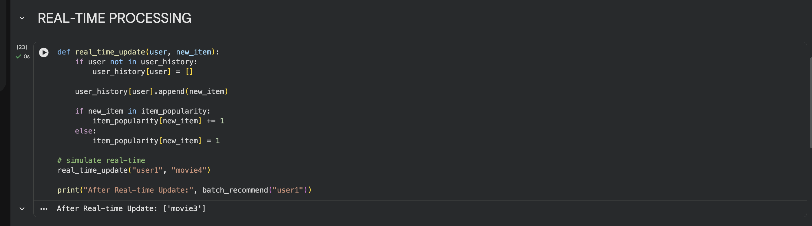
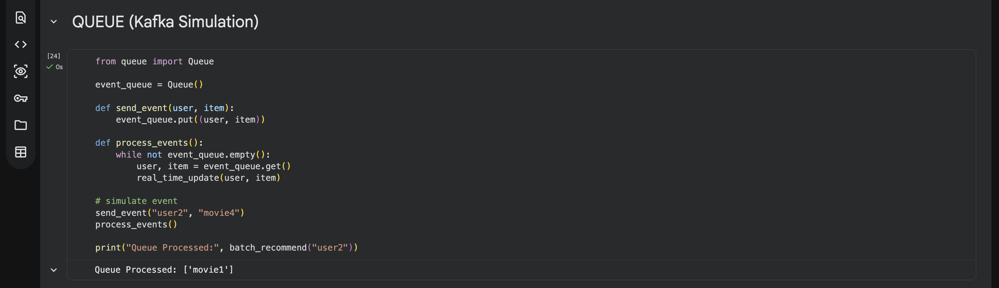
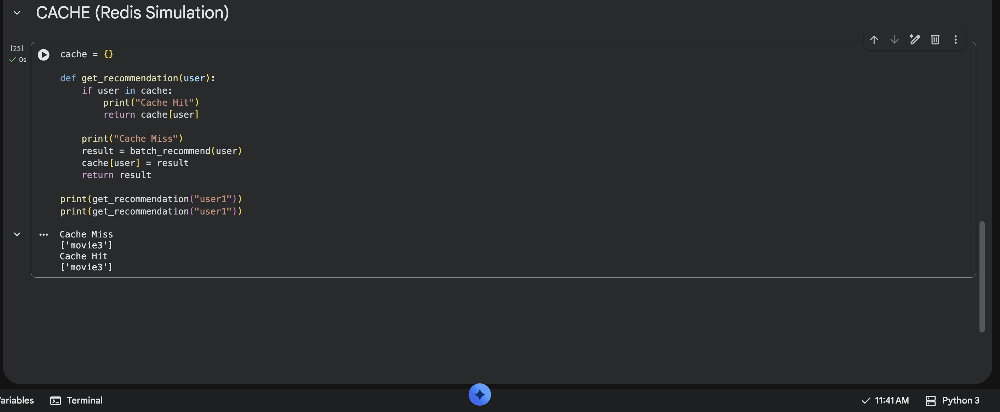

# 🚀 Recommendation System (Batch + Real-time)

A scalable recommendation system that combines **batch processing (historical data)** and **real-time processing (live user actions)** to deliver fast and personalized recommendations.

---

## 👩‍💻 Author

- **Name:** Ragini Singh  
- **Roll No:** 150096724023  
- **Subject:** System Design  

---

## Google Collab Link
https://colab.research.google.com/drive/1ATwTq-IpWsMXiP4KwfenN15wPCPUhNOo?usp=sharing

## Project Documentation Link
https://docs.google.com/document/d/1iXcxE_B0xNkAIaRB9XG5JYcLXlYxifzzyRJKqAmswH4/edit?usp=sharing

## 📌 Problem Statement

Design a recommendation system similar to Netflix/Amazon that:

- Uses **historical data** (batch processing)
- Uses **real-time updates** (user clicks, views)
- Provides **personalized recommendations**
- Works efficiently at **large scale**

---

## 💡 Solution Approach

We use a **hybrid architecture**:

- Batch Layer → learns long-term user behavior  
- Real-time Layer → captures latest activity  
- Queue → handles event streaming  
- Cache → reduces latency  
- Ranking Engine → final recommendation output  

---

## ⚙️ Tech Stack

- **Language:** Python (Google Colab)
- **Data Handling:** Dictionary, List
- **Concepts Used:**
  - Queue (Kafka simulation)
  - Cache (in-memory)
  - Ranking Logic
  - Batch + Real-time processing

---

## 🏗️ System Architecture

Client → Backend → Recommendation Service → Queue →  
Batch Processing + Real-time Processing → Database → Cache → Response  

### 📷 Diagram

---

## 📁 Folder Structure

recommendation-system-batch-realtime/
│
├── recommendation_system.ipynb
│
├── diagrams/
│ └── Recommendation_System.png
│
├── screenshots/
│ ├── sampledata.png
│ ├── batch-processing.png
│ ├── realtime-processing.png
│ ├── queue-kafka.png
│ ├── cache.png
│
├── README.md

---

## 🔄 Data Flow (Step-by-Step)

1. User interacts with system (click/view/purchase)
2. Request goes to backend
3. Event is pushed to queue
4. Real-time processor updates user preferences
5. Batch processor analyzes historical data
6. Ranking engine calculates scores
7. Cache stores recommendations
8. Response returned to user

---

## 🔥 Features Implemented

- Batch recommendation system  
- Real-time update simulation  
- Queue-based event processing  
- Cache for faster response  
- Ranking based on popularity  

---

## 📊 Screenshots

### Sample Data

### Batch Processing

### Real-time Processing

### Queue (Kafka Simulation)

### Cache Layer

---

## 🧪 Sample Logic

- Recommend **most viewed items**
- Use **user history + recent activity**
- Combine batch + real-time signals
- Ranking based on:
  - Popularity
  - Frequency
  - Recent interaction

---

## 🧠 Key Concepts Used

- Client-Server Architecture  
- Queue (Event-driven system)  
- Batch Processing  
- Real-time Processing  
- Caching  
- Ranking Algorithm  
- Scalability  

---

## 🌍 Real-Life Use Case

- Netflix → Movie recommendations  
- Amazon → Product suggestions  
- Instagram → Feed ranking  

---

## 📌 Project Files

- Google Colab Notebook (.ipynb)  
- Architecture Diagram  
- Output Screenshots  

---

## 🚀 Future Improvements

- Add Machine Learning model  
- Use real database (MongoDB / SQL)  
- Implement APIs using Flask/FastAPI  
- Deploy system on cloud  
- Add user authentication  

---

## 📌 Conclusion

This project demonstrates how modern large-scale systems combine:

- Batch Processing → accuracy  
- Real-time Processing → freshness  
- Cache → speed  
- Queue → scalability  

to deliver **fast, scalable, and personalized recommendations**.

---
